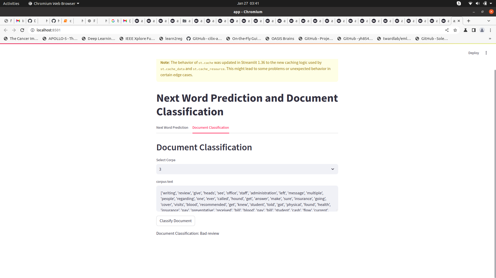

*This is NLP task1 word embeeding using skipGram, glove, and genim*

*The data is taken from huggyFace*
*The next dataset for next word prediction is from kaggle harry potter book*
https://huggingface.co/datasets/fancyzhx/yelp_polarity/viewer/plain_text/train?q=food+explained

Please access the web app 
https://nlpassignment2-nkf6fskfmspwe2vguuvhwy.streamlit.app/

* since the we were not able load the full corpus during the runtime of app so we only added few rows from the book that is why the model was degrading performance
* loading full corpus during runtime is not allowing the model to deploy
* In order to check the working the model works in sequences like first model take input as [w1,w2,w3,w4] and predicts [w5] and then [w2,w3,w4,w5] and predict [w6] this ways corpus becomes big
* the number on the web page allow the user to select the document [w1,w2,w3,w4] is 0 then [w2,w3,w4,w5] is 1 and so on 
* this work has two model one is bi-directional lstm for next word predict and another is attention model for document classification

  

