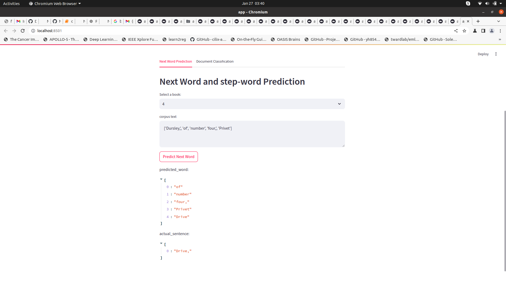

*This is NLP task1 word embeeding using skipGram, glove, and genim*

*The data is taken from huggyFace*
*The next dataset for next word prediction is from kaggle harry potter book*
https://huggingface.co/datasets/fancyzhx/yelp_polarity/viewer/plain_text/train?q=food+explained

* since the we were not able load the full corpus during the runtime of app so we only added few rows from the book
* this work has two model one is bi-directional lstm for next word predict and another is attention model for document classification
* 

